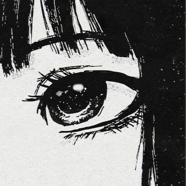
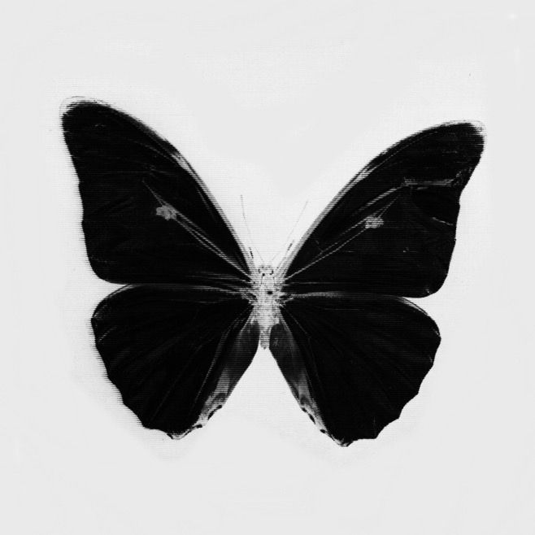
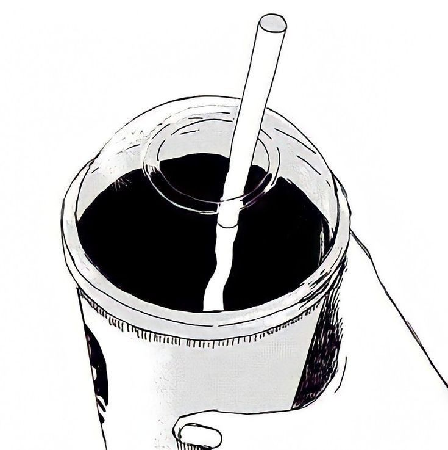

 


 

```
BS Computer Science with specialization in Digital Forensics student 
Main interests in Data Science & Cybersec
Working on my Mental Health
Learning about Machine Learning 
Main languages: Python, Java, php 
Interested in learning network security and web security
In a complicated relationship with loops and Eclipse IDE
Love reading non fictions, sports, gaming, watching movies and stargazing
Love alternative rock, jazz, pop, classical and blues
Love dumplings 🥟
Interest: Dogs, Self Care, Cats, Coffee, and Coding.
I’m looking to network and make friends here!
Hobbies: Crochet, Anime, Gacha Games, and Books.
```


<p align="center"> 
   
</p>

  
  <br></br>  
  
<div class="row" align="center">
  <h2> <strong> Actively Learning </strong></h2>
  <p align="center">
    
    
    
    
      <br> </br>
    
  </p>
<p align="center">
  <h2> <strong> Plan to Learn </strong></h2>
  
</p>
  
<br></br>
<br></br>

  
   


<!-- Snake game of GitHub Contributions https://github.com/marketplace/actions/generate-snake-game-from-github-contribution-grid -->


<section>
  <h3 align="center"> <strong> Connect With Me </strong></h3>

  [](https://open.spotify.com/user/3155dbfmkqw2jherqaypz4ieadxm?si=e47272ee106f4127)
  [](https://www.instagram.com/aouiara/?hl=en)

</section>

